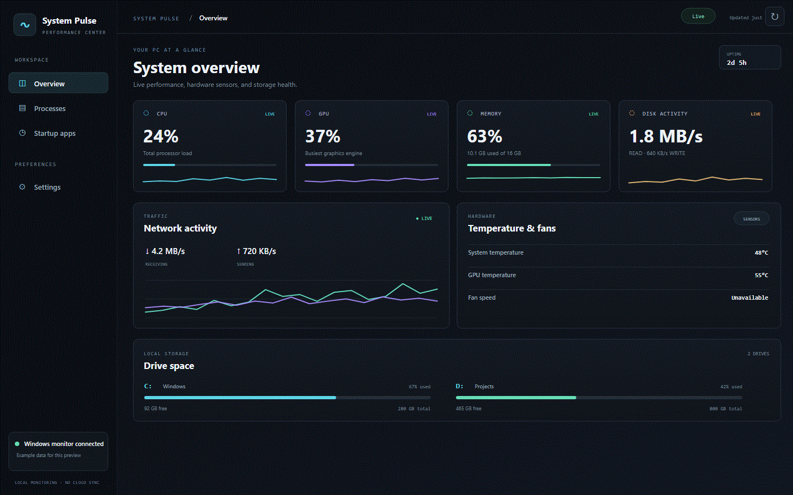
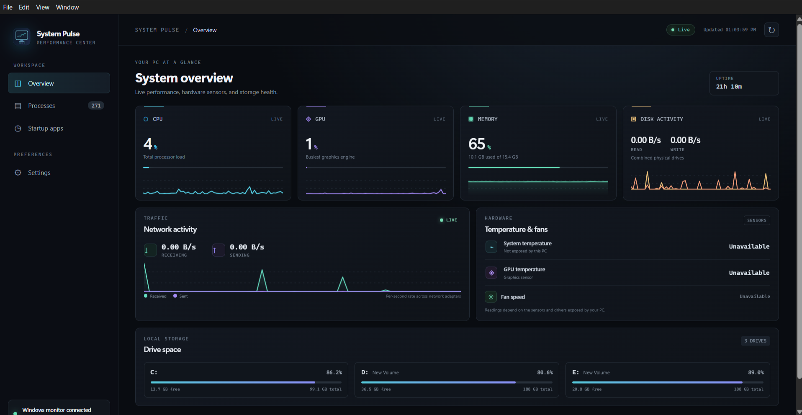
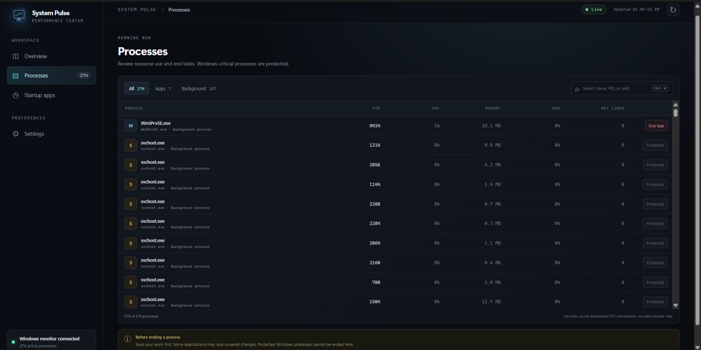
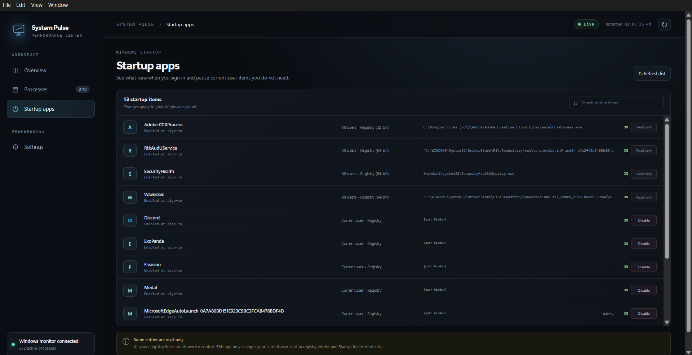
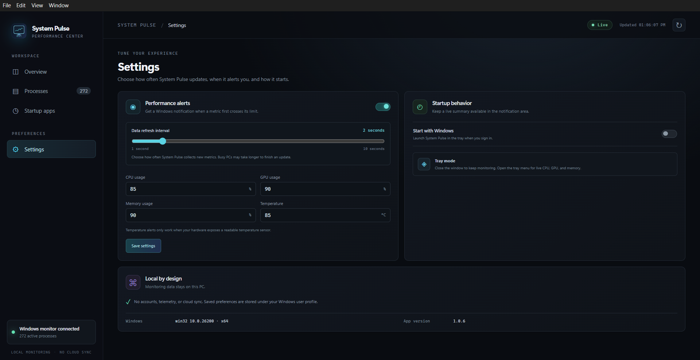

# System Pulse

System Pulse is a Windows desktop app for checking PC performance, reviewing running processes, and managing startup apps from one place.

> **Screenshots:** The four screenshots below are from the running app. The startup screenshot hides command paths for privacy. The animated tour and WebM video use generated example data.

## Take a quick tour



[Download the short video walkthrough (WebM)](docs/media/walkthrough.webm)

## Screenshots

### Performance dashboard



### Process manager



### Startup apps



### Settings



## Features

### System monitor

- Shows CPU, GPU, and memory usage with recent history graphs.
- Tracks network send and receive rates, plus disk read and write rates.
- Shows used and free space on fixed drives, and system uptime.
- Displays system and GPU temperatures and fan RPM when Windows exposes those sensors.
- Updates every 1–10 seconds. The default is 2 seconds; change it in **Settings → Data refresh interval**.
- Sends optional Windows notifications when CPU, GPU, memory, or available temperature readings cross their configured limits.
- Keeps a live CPU, GPU, and memory summary in the notification-area tray icon tooltip.

### Process manager

- Lists applications and background processes. Search by name, process ID, or path; filter by **All**, **Apps**, or **Background**.
- Shows process ID, CPU, private memory, GPU activity, and established TCP connection count.
- **End task** first asks Windows to close the process. If it remains open, System Pulse asks before force-ending it.
- Blocks known critical Windows processes and warns before ending processes located in the Windows folder.

The network column is the number of established TCP connections owned by each process. It is not a per-process network speed measurement. System-wide network rates are shown on the dashboard.

### Startup apps

- Lists startup entries from the current-user and all-users Run registry keys and the current-user Startup folder.
- Lets you enable or disable entries for your Windows account.
- Shows all-users entries as read-only because they apply to other Windows accounts too.

### Settings and privacy

- Adjust the metrics refresh interval from 1 to 10 seconds.
- Configure optional CPU, GPU, memory, and temperature alert limits.
- Choose whether System Pulse opens when you sign in to Windows.
- Monitoring and preferences stay on your PC. System Pulse does not send process, performance, hardware, or startup data to a server.

## Install and run

1. Open the project's **Releases** page on GitHub and download **System Pulse Setup 1.0.6.exe**.
2. Run the installer. It installs for your Windows account and adds Start menu and desktop shortcuts.
3. Open **System Pulse** from the Start menu or desktop.

You can also download **System Pulse 1.0.6.exe** to use the portable version without installing it. Both downloads are Windows x64 apps; Node.js is not needed to run them.

To end a process that Windows restricts, close System Pulse and launch it with Windows' **Run as administrator** option. Ending a process can discard unsaved work, so save first.

## How it works

System Pulse runs on Windows and collects performance and process information locally using Windows performance counters and CIM data through PowerShell. The Electron app displays each sample and schedules the next one using the refresh interval you selected. Startup entries and changes are also read and applied locally.

No account or internet connection is required for monitoring. GPU, temperature, and fan readings depend on the counters, drivers, and sensors available on the PC. If Windows does not expose a reading, System Pulse shows it as unavailable. System-wide GPU usage is the busiest GPU engine reported by Windows; per-process GPU values are summed from engines attributed to that process and capped at 100%.

## Run from source

For development, use Windows x64 and Node.js 22.12 or newer:

```powershell
npm install
npm start
```

PowerShell is used locally to collect Windows data and manage startup entries. System Pulse does not execute user-saved shell commands.

## Build the Windows executables

```powershell
npm install
npm run dist
```

To build one package:

```powershell
npm run dist:installer
npm run dist:portable
```

The installer and portable builds are written to `release/`. The project uses Electron and electron-builder. The app icon is generated from `assets/generate_icon.py`.


